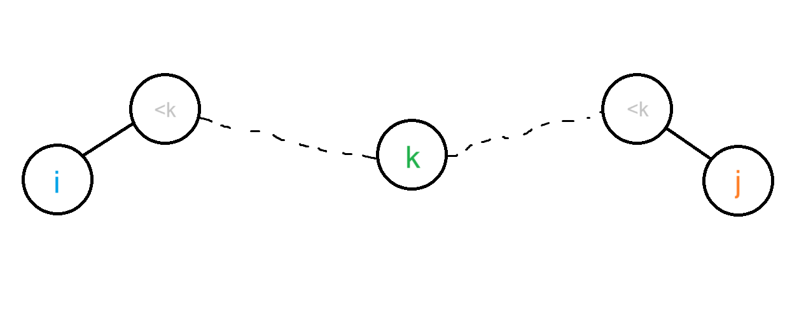
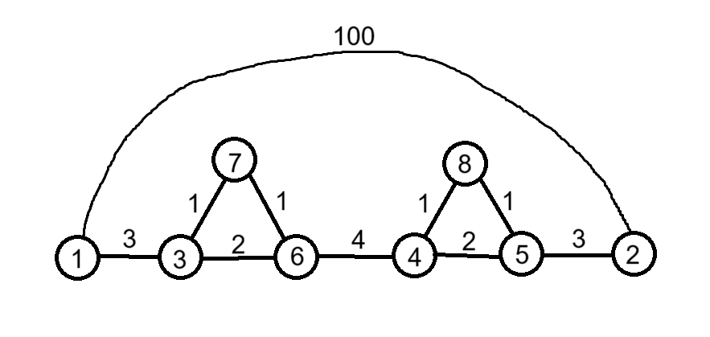

# Floyd-Warshall算法计算最短路条数

## 基本实现

以下是基本的Floyd-Warshall算法的C++实现

```C++
#include <iostream>
#include <cstring>
using namespace std;

#define N 10
#define INF 1000000000

int f[N][N];// 使用邻接矩阵存储

long long read()
{
    long long c = getchar(), r = 0, f = 1;
    while(c < '0' || c > '9')
    {
        if(c == '-')f = -1;
        c = getchar();
    }
    while(c >= '0' && c <= '9')
    {
        r = (r << 1) + (r << 3) + c - '0';
        c = getchar();
    }
    return r * f;
}

int main()
{
    int n = read(), m = read();
    for(int i = 1;i <= n;++i)
        for(int j = 1;j <= n;++j)
        {
            f[i][j] = INF;// INF不应过大，因为后续可能会出现两个INF相加导致溢出
        }
    for(int i = 1;i <= m;++i)
    {
        int u = read(), v = read(), w = read();
        f[u][v] = w;
    }
    for(int k = 1;k <= n;++k)
        for(int i = 1;i <= n;++i)
            for(int j = 1;j <= n;++j)
            {
                f[i][j] = min(f[i][j], f[i][k] + f[k][j]);
            }
    printf("%d", f[1][2]);// 输出的是1到2的最短路
    return 0;
}
```

如果是无向图，除了上面的实现（无向边看成有向图的两条双向边）外，还可以有以下的减小一半计算的实现, 因为无向图中，$i$到$j$的最短路径和$j$到$i$的最短路径是等价的

```C++
for(int i = 1;i <= m;++i)
{
    int u = read(), v = read(), w = read();
    f[u][v] = f[v][u] = w;
}
for(int k = 1;k <= n;++k)
    for(int i = 1;i <= n;++i)
        for(int j = i + 1;j <= n;++j)
        {
            f[i][j] = f[j][i] = min(f[i][j], f[i][k] + f[k][j]);
        }
```

## 拓展的思路

方案的代价总是会比方案的具体说明更好得出，这也是动态规划的通常规律了（是的，Floyd-Warshall算法可以说使用了动态规划的思想，以中间加入的结点作为阶段）

如果要使用Floyd-Warshall算法计算最短路的条数，首先要回归到Floyd-Warshall算法的运行过程：

```C++
f[i][j] = f[j][i] = min(f[i][j], f[i][k] + f[k][j]);
```



在考虑结点$k$时，如果$f[i][k] + f[k][j] < f[i][j]$（$i$到$k$的最短路 + $k$到$j$的最短路 比 原来$i$到$j$的最短路 小），那么用前者更新$f[i][j]$（$i$到$j$的最短路）。

所以计算的时机就在此了。这里，我们用$b[i][j]$表示i到j的最短路的条数。根据$f[i][k] + f[k][j]$和$f[i][j]$的大小关系，我们分情况讨论如何更新$b[i][j]$：

* $f[i][k] + f[k][j] < f[i][j]$:新的最短路出现了，需将新计算的$b[i][j]$覆盖原来的结果

* $f[i][k] + f[k][j] == f[i][j]$:这时另一类（不是“个”，因为这次贡献可能不止一条）最短路出现了，将计算得出的贡献加入原$b[i][j]$。

* $f[i][k] + f[k][j] > f[i][j]$:这时最短路都没有更新，自然不需要更新$b[i][j]$

所以说，我们只需要考虑$f[i][k] + f[k][j] < f[i][j]$和$f[i][k] + f[k][j] == f[i][j]$的情况，那么如何计算呢？

我们这样考虑（仅是思路，严格证明在后）：

<figure>考虑到结点k时：</figure>

* $f[i][k] + f[k][j] < f[i][j]$意味着新的最短路出现，且所有$i$和$j$经过结点**最大编号为**$k$的路径中最短路（回想Floyd-Warshall算法在计算$f[i][j]$时的含义）经过了结点$k$，那么我们就可以通过结点$k$计算$b[i][j]$。根据乘法原理，$i$和$j$经过结点**最大编号为**$k$的路径中最短路的个数应为 $i$到$k$走最短路径的方法数 * k到j走最短路径的方法数（$b[i][j] = b[i][k] * b[k][j]$）。

.png)

* $f[i][k] + f[k][j] == f[i][j]$时，说明找到了另外相同路径长的最短路，同样根据乘法原理计算出贡献，将该值归入$b[i][j]$中($b[i][j] += b[i][k] * b[k][j]$)。

.png)

---

有些人可能会觉得这样会重复计算，于是这样考虑：

<figure>考虑到结点k时：</figure>

* $f[i][k] + f[k][j] < f[i][j]$时，让$\mathit{b[i][j] = 1}$；

* $f[i][k] + f[k][j] == f[i][j]$时，说明可以通过一个新的结点$k$产生最短路，否则，这个结点k就会在$i$和$j$原来的最短路上，而这样的话，在结点k加入考虑范围内前，$f[i][j]$无法通过这条路径更新最短路径长，说明$f[i][j]$通过另一条最短路径计算出与$f[i][k] + f[k][j]$相等的值，依然回到了原结论。每一条最短路径上都会有编号更大的点进行更新，所以此时，让$\mathit{b[i][j] += 1}$。


两者究竟正确性如何，我们可以测试一下：

* 方法一:

```C++
for(int k = 1;k <= n;++k)
    for(int i = 1;i <= n;++i)
        for(int j = 1;j <= n;++j)
        {
            if(f[i][k] + f[k][j] < f[i][j])
            {
                f[i][j] = f[i][k] + f[k][j];
                b[i][j] = b[i][k] * b[k][j];
            }
            else if(f[i][k] + f[k][j] == f[i][j])
            {
                b[i][j] += b[i][k] * b[k][j];
            }
        }
```

* 方法二：
```C++
for(int k = 1;k <= n;++k)
    for(int i = 1;i <= n;++i)
        for(int j = 1;j <= n;++j)
        {
            if(f[i][k] + f[k][j] < f[i][j])
            {
                f[i][j] = f[i][k] + f[k][j];
                b[i][j] = 1;
            }
            else if(f[i][k] + f[k][j] == f[i][j])
            {
                b[i][j]++;
            }
        }
```

我们使用这样的测试数据进行测试，这里偷了些懒，构造的是无向图

```
8 10
1 3 3
1 2 100
3 7 1
7 6 1
3 6 2
6 4 4
4 8 1
8 5 1
4 5 2
5 2 3

```


计算f[1][2]和b[1][2]:

* 方法一

```
14 4
```

* 方法二

```
14 3
```

看起来第一种可能是对的，而第二种肯定是错的。

## 正确性的考虑与原因

我们先讨论为什么第二种是错的。


在测试数据中，我们如果使用第二种思路考虑，会发现，通过编号更大的结点更新最短路时，只会更新3次（结点6开始有一条最短路，7一条，8一条），这非常有误导性，进一步，我们发现，不是每一条通过编号更大的结点更新的最短路都能对应一个结点，比如结点8，其实有两条最短路都只能对应结点8($1-3-7-6-4-8-5-2$和$1-3-6-4-8-5-2$)，漏掉的一条就是结点8少对应的一条。

也就是说，尽管$f[i][k] + f[k][j] == f[i][j]$表示出现了另一类最短路，即上面的反证是对的，但不是每一条最短路都一一对应着一个用于更新的结点，多条最短路可能对应着一个更新的结点。所以这种想法会导致漏的情况。

那么第一种方法是对的吗？

~~事实上，洛谷里的题解[[NOI2007]社交网络](https://www.luogu.com.cn/problem/solution/P2047)多数就是这么写的，所以它就是对的（洛谷证明法）~~

：（

我已经想到了较为严格的证明方法，但得等我有时间再讨论了。其实本来在思路时就不知不觉打出来了，但看完感觉那样会破坏思维重现的连贯，而且更加难以理解，所以就简化了思路，打算搬到这里来详细讨论证明。

## 尾声

所以说，Floyd-Warshall算法是可以计算最短路数量的，这也算是弥补了《数据结构》课上的Floyd-Warshall算法（唉这名字是真的长）的最短路计数的空缺了。

Floyd-Warshall算法的实现是很简单的，这就使得很多人（比如过去的我）在听不懂原理时选择忽略。然而，如果不去了解算法的机制，那么到需要变通算法时便束手无策了，甚至无法从理论上解释不可行的原因。课上讲的，无论是数据结构还是算法，都只是基础，实际应用时往往需要变通。所以，了解数据结构和算法的过程和正确性是很有必要的。

如果还要能够求出两个结点间所有的最短路，理论上应该是可行的，但那太麻烦了，还是等真正需要时再说吧XD。
